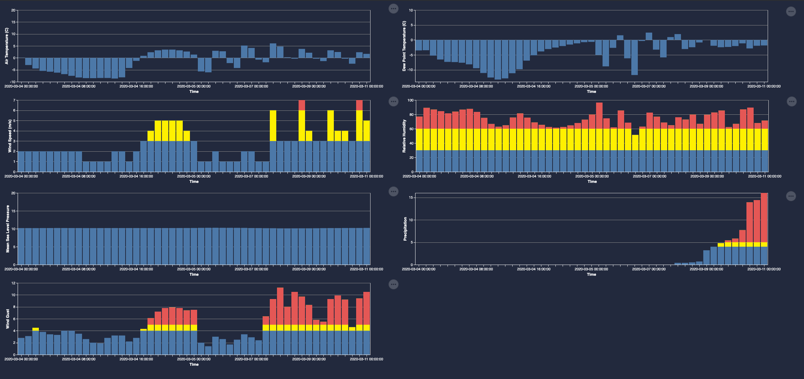

# Usage

### URL Parameters

	token (required): Spire Weather API token

	lat (required): latitude of point forecast

	lon (required): longitude of point forecast

	name (optional): name of location

	bundles (optional): "basic,maritime,renewable-energy" or a subset of the three (default = basic)

	icao (optional): supersedes lat/lon/name/bundles parameters and uses the Optimized Point Forecast instead (can also specify WMO identifier rather than ICAO)

	tempscale (optional): "C" for Celsius, "F" for Fahrenheit, "K" for Kelvin (default = Celsius)

	units (optional): "imperial" for Imperial (including Fahrenheit), otherwise Metric

### Example

https://elliott-spire.github.io/visual-weather/?name=Dotsero&lat=39.66061&lon=-107.0350&token=[YOURTOKEN]

